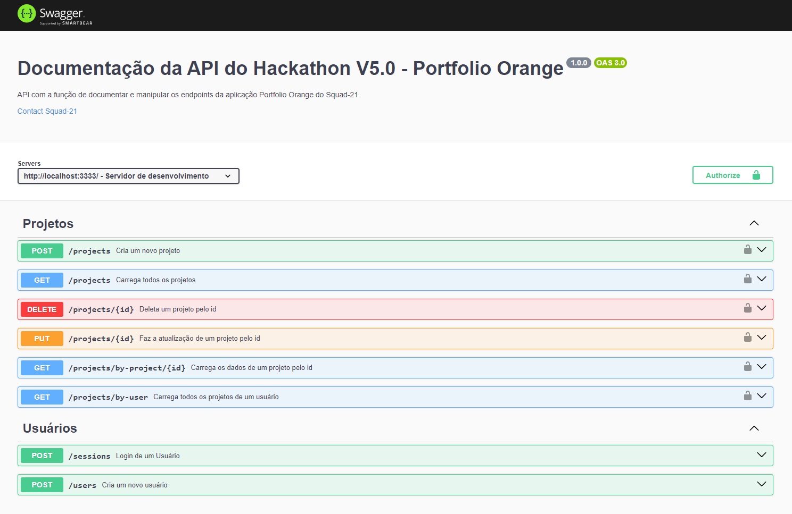

<div align="center">
 <h1>Programa de Formação FCamara V5.0 - 2024</h1>
 <h1>Hackathon - Projeto Orange Portfólio </h1>
 <h2>Squad 21 -  Backend<h2>
</div>

## 💻 Sobre o Projeto

<p align="justify">O desafio desse projeto consiste em uma aplicação web, responsiva, denominada Orange Portfólio, que permitirá aos usuários cadastrar, atualizar, deletar e exibir seus projetos desenvolvidos.
</p>

---

### 📚 Manual do Hackathon - Projeto Orange Portfólio

<p> Manual com as requisições, regras e propostas do desafio </p>

[Clique aqui](./Manual%20do%20Hackathon%20-%20Programa%20de%20Formação%20Season%205.pdf)

---

### 📐 O design do projeto no Figma

[Figma - Portifólio Orange](https://www.figma.com/file/utDx59m5Opz1lDSN1J4r9I/Desafio---Programa-de-Forma%C3%A7%C3%A3o-5.0?type=design&mode=design&t=upUd2uD97JqrEuYN-0)

---

### 💾 Tecnologias usadas

[<br>](https://github.com/)
<br>
[](https://nodejs.org/)<br>
[](https://www.typescriptlang.org/)<br>
[](https://expressjs.com/)<br>
[](https://swagger.io)<br>
[](https://www.postgresql.org/)<br>
[](https://typeorm.io/)<br>
[](https://www.npmjs.com/package/bcryptjs)<br>
[](https://www.npmjs.com/package/jsonwebtoken)<br>
[](https://aws.amazon.com/pt/)<br>
[](https://www.docker.com/)<br>

---

### 🛠️ Executando o projeto da API localmente (Linux ou Windows)

#### - Api

````

git clone https://github.com/eduardodarocha/squad-21-backend.git

cd squad-21-backend

yarn install | npm install

yarn dev | npm run dev
````

#### - Database local (PostgreSQL)

- Utilizado o docker para a instalação do PostgreSQL.
  - É necessário ter o Docker instalado.

````

docker run -d --name <nome_do_container> -e POSTGRES_USER=<nome_do_usuário> -e POSTGRES_PASSWORD=<senha_do_usuário> -p 5432:5432 -d <imagem_do_postgres>

````

- Migrations

````

yarn typeorm migration:generate --name <EscrevaUnNomeParaMigration>

yarn typeorm migration:run

````

### 📚 Documentação da API

#### - Collections

<p>Collections para uso no  Insomnia ou  Postman</p>

[](./collections_proj_portfolio_orange.json)

#### - Swagger

[Swagger Api Documentation](https://api.eduardorocha.dev/api-docs/)

[](https://api.eduardorocha.dev/api-docs/)

### ☁️ Deploy Produção

- API - [AWS EC2](https://aws.amazon.com/pt/ec2/ "Capacidade de computação segura e redimensionável para praticamente qualquer workload")
- Database - [AWS EC2](https://aws.amazon.com/pt/ec2/ "Capacidade de computação segura e redimensionável para praticamente qualquer workload")
- Imagens - [AWS S3](https://aws.amazon.com/pt/s3/ "Armazenamento de objetos construído para armazenar e recuperar qualquer volume de dados de qualquer loca")


### 🚀 Equipe do Squad-21

- Bruna Lima (Backend) - [Github](https://github.com/BruFurtado) [Linkedin](https://www.linkedin.com/in/brunalima)
- Eduardo Rocha (Backend) - [Github](https://github.com/eduardodarocha) [Linkedin](https://www.linkedin.com/in/eduardo-rocha-dev/)
- Gleison Ferreira (Frontend)- [Github](https://github.com/gleisonfernandes) [Linkedin](https://www.linkedin.com/in/gleison-fernandes-da-silva-54b907105/)
- Luisa Lopes (Frontend) - [Github](https://github.com/herlocksholmes1888) [Linkedin](https://www.linkedin.com/in/luisa-frugoli-valente-lopes-b5b533231/)


## 👏🏼 Agradecimentos especiais à equipe de mentores do Programa de Formação da FCamara e a todas as pessoas que nos ajudaram no decorrer de todo o processo! 🙏🏻
